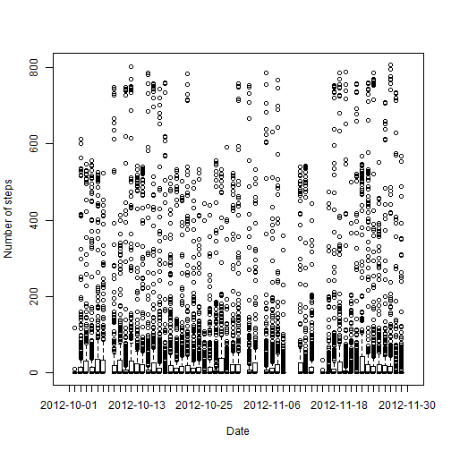
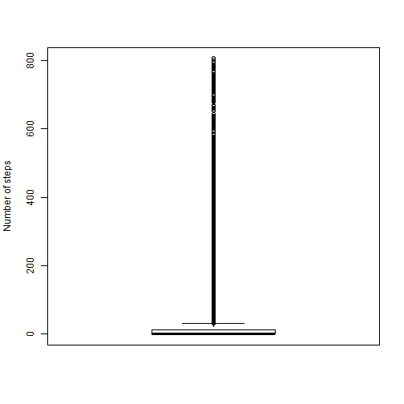
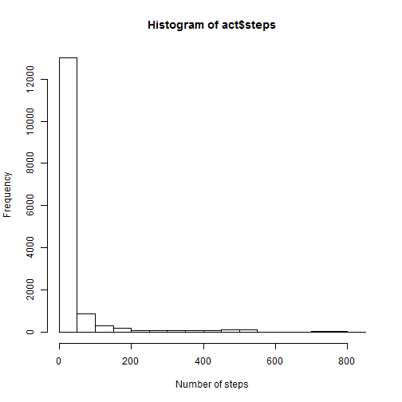
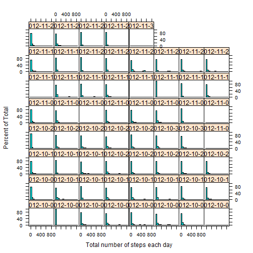
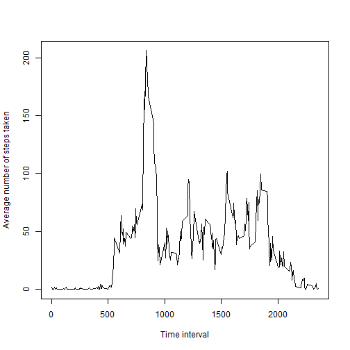
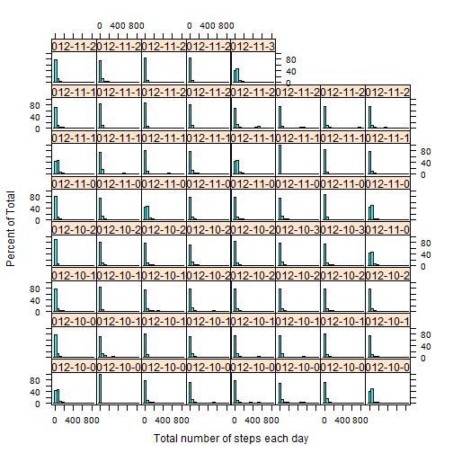
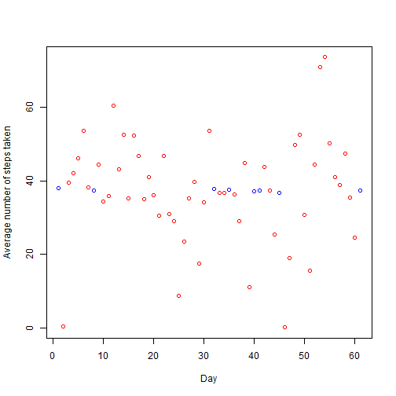
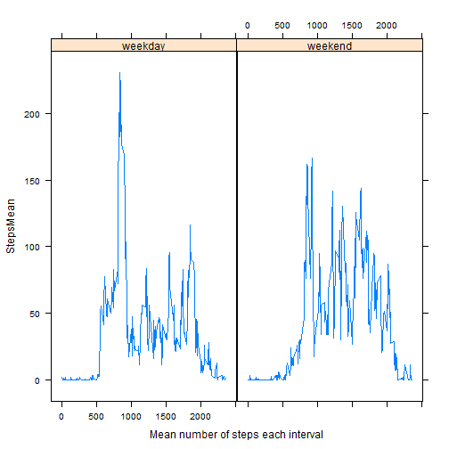

#Loading and preprocessing the data

##Preparation

First we'll have a look at the software environment in which this exercise will be made and what the current working directory on the local machine is.


```r
sessionInfo()
```

```
## R version 3.2.3 (2015-12-10)
## Platform: i386-w64-mingw32/i386 (32-bit)
## Running under: Windows 7 (build 7601) Service Pack 1
## 
## locale:
## [1] LC_COLLATE=English_United States.1252 
## [2] LC_CTYPE=English_United States.1252   
## [3] LC_MONETARY=English_United States.1252
## [4] LC_NUMERIC=C                          
## [5] LC_TIME=English_United States.1252    
## 
## attached base packages:
## [1] stats     graphics  grDevices utils     datasets  methods   base     
## 
## other attached packages:
## [1] knitr_1.11
## 
## loaded via a namespace (and not attached):
## [1] magrittr_1.5  formatR_1.2.1 tools_3.2.3   stringi_1.0-1 stringr_1.0.0
## [6] evaluate_0.8
```

```r
getwd()
```

```
## [1] "D:/Gegevens/Coursera/DS5/RepData_PeerAssessment1"
```

As this is an international course, it is inconvenient to report anything in Dutch, so we'll switch the language to US English so that date, time and other language dependent things can be understood by everybody. We'll also set a separate working directory for this assessment


```r
Sys.setlocale("LC_ALL","English")
```

```
## [1] "LC_COLLATE=English_United States.1252;LC_CTYPE=English_United States.1252;LC_MONETARY=English_United States.1252;LC_NUMERIC=C;LC_TIME=English_United States.1252"
```

```r
setwd("D:/Gegevens/Coursera/DS5")
```

##Getting and loading the data
The data are available on the web via a [ZIP-archive](https://d396qusza40orc.cloudfront.net/repdata%2Fdata%2Factivity.zip). Let us first download the date, keeping track of the moment on which the download took place.


```r
download.file("https://d396qusza40orc.cloudfront.net/repdata%2Fdata%2Factivity.zip","act.zip")
date.downloaded<-Sys.time()
date.downloaded
```

```
## [1] "2015-12-21 12:19:03 CET"
```

As the data are in a ZIP-archive, we'll need to extract the archive in order to access the data. We'll unzip into a temporary directory, list the file(s) in that directory (throw an error if there's more than one), read the first file and store it in R as a data frame.


```r
zipdir<-tempfile()
dir.create(zipdir)
unzip("act.zip",exdir=zipdir)
files <- list.files(zipdir)
if(length(files)>1) stop("More than one data file inside zip")
file <- paste(zipdir, files[1], sep="/")
act <- read.csv(file)
```

##Having a first look at the data

Now we have the data in R, we'll have a first look at it using the head, tail and structure functions. 


```r
head(act)
```

```
##   steps       date interval
## 1    NA 2012-10-01        0
## 2    NA 2012-10-01        5
## 3    NA 2012-10-01       10
## 4    NA 2012-10-01       15
## 5    NA 2012-10-01       20
## 6    NA 2012-10-01       25
```

```r
tail(act)
```

```
##       steps       date interval
## 17563    NA 2012-11-30     2330
## 17564    NA 2012-11-30     2335
## 17565    NA 2012-11-30     2340
## 17566    NA 2012-11-30     2345
## 17567    NA 2012-11-30     2350
## 17568    NA 2012-11-30     2355
```

```r
str(act)
```

```
## 'data.frame':	17568 obs. of  3 variables:
##  $ steps   : int  NA NA NA NA NA NA NA NA NA NA ...
##  $ date    : Factor w/ 61 levels "2012-10-01","2012-10-02",..: 1 1 1 1 1 1 1 1 1 1 ...
##  $ interval: int  0 5 10 15 20 25 30 35 40 45 ...
```

The structure function learns us that the dataset contains three variables. steps is an integer variable containing a lot of NA's. date is a factor with 61 levels. Knowing that a lot of NA's are present, we'll need to be carefull applying different functions like sums, means and medians. The option na.rm=TRUE or another way to deal with them will be needed.

The table function can be used to examine the frequencies of recordings. 


```r
table(act$date)
```

```
## 
## 2012-10-01 2012-10-02 2012-10-03 2012-10-04 2012-10-05 2012-10-06 
##        288        288        288        288        288        288 
## 2012-10-07 2012-10-08 2012-10-09 2012-10-10 2012-10-11 2012-10-12 
##        288        288        288        288        288        288 
## 2012-10-13 2012-10-14 2012-10-15 2012-10-16 2012-10-17 2012-10-18 
##        288        288        288        288        288        288 
## 2012-10-19 2012-10-20 2012-10-21 2012-10-22 2012-10-23 2012-10-24 
##        288        288        288        288        288        288 
## 2012-10-25 2012-10-26 2012-10-27 2012-10-28 2012-10-29 2012-10-30 
##        288        288        288        288        288        288 
## 2012-10-31 2012-11-01 2012-11-02 2012-11-03 2012-11-04 2012-11-05 
##        288        288        288        288        288        288 
## 2012-11-06 2012-11-07 2012-11-08 2012-11-09 2012-11-10 2012-11-11 
##        288        288        288        288        288        288 
## 2012-11-12 2012-11-13 2012-11-14 2012-11-15 2012-11-16 2012-11-17 
##        288        288        288        288        288        288 
## 2012-11-18 2012-11-19 2012-11-20 2012-11-21 2012-11-22 2012-11-23 
##        288        288        288        288        288        288 
## 2012-11-24 2012-11-25 2012-11-26 2012-11-27 2012-11-28 2012-11-29 
##        288        288        288        288        288        288 
## 2012-11-30 
##        288
```

```r
table(act$interval)
```

```
## 
##    0    5   10   15   20   25   30   35   40   45   50   55  100  105  110 
##   61   61   61   61   61   61   61   61   61   61   61   61   61   61   61 
##  115  120  125  130  135  140  145  150  155  200  205  210  215  220  225 
##   61   61   61   61   61   61   61   61   61   61   61   61   61   61   61 
##  230  235  240  245  250  255  300  305  310  315  320  325  330  335  340 
##   61   61   61   61   61   61   61   61   61   61   61   61   61   61   61 
##  345  350  355  400  405  410  415  420  425  430  435  440  445  450  455 
##   61   61   61   61   61   61   61   61   61   61   61   61   61   61   61 
##  500  505  510  515  520  525  530  535  540  545  550  555  600  605  610 
##   61   61   61   61   61   61   61   61   61   61   61   61   61   61   61 
##  615  620  625  630  635  640  645  650  655  700  705  710  715  720  725 
##   61   61   61   61   61   61   61   61   61   61   61   61   61   61   61 
##  730  735  740  745  750  755  800  805  810  815  820  825  830  835  840 
##   61   61   61   61   61   61   61   61   61   61   61   61   61   61   61 
##  845  850  855  900  905  910  915  920  925  930  935  940  945  950  955 
##   61   61   61   61   61   61   61   61   61   61   61   61   61   61   61 
## 1000 1005 1010 1015 1020 1025 1030 1035 1040 1045 1050 1055 1100 1105 1110 
##   61   61   61   61   61   61   61   61   61   61   61   61   61   61   61 
## 1115 1120 1125 1130 1135 1140 1145 1150 1155 1200 1205 1210 1215 1220 1225 
##   61   61   61   61   61   61   61   61   61   61   61   61   61   61   61 
## 1230 1235 1240 1245 1250 1255 1300 1305 1310 1315 1320 1325 1330 1335 1340 
##   61   61   61   61   61   61   61   61   61   61   61   61   61   61   61 
## 1345 1350 1355 1400 1405 1410 1415 1420 1425 1430 1435 1440 1445 1450 1455 
##   61   61   61   61   61   61   61   61   61   61   61   61   61   61   61 
## 1500 1505 1510 1515 1520 1525 1530 1535 1540 1545 1550 1555 1600 1605 1610 
##   61   61   61   61   61   61   61   61   61   61   61   61   61   61   61 
## 1615 1620 1625 1630 1635 1640 1645 1650 1655 1700 1705 1710 1715 1720 1725 
##   61   61   61   61   61   61   61   61   61   61   61   61   61   61   61 
## 1730 1735 1740 1745 1750 1755 1800 1805 1810 1815 1820 1825 1830 1835 1840 
##   61   61   61   61   61   61   61   61   61   61   61   61   61   61   61 
## 1845 1850 1855 1900 1905 1910 1915 1920 1925 1930 1935 1940 1945 1950 1955 
##   61   61   61   61   61   61   61   61   61   61   61   61   61   61   61 
## 2000 2005 2010 2015 2020 2025 2030 2035 2040 2045 2050 2055 2100 2105 2110 
##   61   61   61   61   61   61   61   61   61   61   61   61   61   61   61 
## 2115 2120 2125 2130 2135 2140 2145 2150 2155 2200 2205 2210 2215 2220 2225 
##   61   61   61   61   61   61   61   61   61   61   61   61   61   61   61 
## 2230 2235 2240 2245 2250 2255 2300 2305 2310 2315 2320 2325 2330 2335 2340 
##   61   61   61   61   61   61   61   61   61   61   61   61   61   61   61 
## 2345 2350 2355 
##   61   61   61
```

With the table function (date) we learn that data were collected on 61 subsequent days from the beginning of october till the end of november 2012. With the table function (interval) we learn that, Within each day, the number of steps is recorded each 5 minutes (thus 12 times per hour). Interval is an integer value constructed from a time: the last two digits indicate the minutes within an hour, the first (none, one or two) indicate the hour itself. 


```r
recordingsperhour<-12
recordingsperhour
```

```
## [1] 12
```

```r
recordingsperday<-24*recordingsperhour
recordingsperday
```

```
## [1] 288
```

```r
recordingsoctober<-31*recordingsperday
recordingsoctober
```

```
## [1] 8928
```

```r
recordingsnovember<-30*recordingsperday
recordingsnovember
```

```
## [1] 8640
```

```r
recordingstotal<-recordingsoctober+recordingsnovember
recordingstotal
```

```
## [1] 17568
```

So each day, 12*24=288 measurements are recorded. If we multiply this by 61 days, we get 17568, or the total number of observations within the dataset. 

Off course, it is also usefull to do some exploratory graphs.


```r
plot(act$steps~act$date,xlab="Date",ylab="Number of steps")
```

 

```r
boxplot(act$steps,ylab="Number of steps")
```

 

```r
hist(act$steps,xlab="Number of steps")
```

 

With the plot function we can see that the steps variable is highly variable and skewed to the left per day. With the boxplot and the histogram function we can get the total picture over 61 days.  

##Total, mean and median number of steps per day

The total number of steps per day can be calculated by applying the sum function over the steps variable using the date as grouping variable. The option na.rm=TRUE has to be used since we learnt that a lot of NA's are present in the dataset. Just for analogy, mean and median number of steps per day are also calculated. We'll do this using the dplyr package (group_by and summarize functions).  


```r
library("dplyr")
```

```
## 
## Attaching package: 'dplyr'
## 
## The following objects are masked from 'package:stats':
## 
##     filter, lag
## 
## The following objects are masked from 'package:base':
## 
##     intersect, setdiff, setequal, union
```

```r
byday<-group_by(act,date)
tidyd<-summarize(byday,StepsSum=sum(steps,na.rm=TRUE),StepsMean=mean(steps,na.rm=TRUE),StepsMedian=median(steps,na.rm=TRUE))
tidyd
```

```
## Source: local data frame [61 x 4]
## 
##          date StepsSum StepsMean StepsMedian
##        (fctr)    (int)     (dbl)       (dbl)
## 1  2012-10-01        0       NaN          NA
## 2  2012-10-02      126   0.43750           0
## 3  2012-10-03    11352  39.41667           0
## 4  2012-10-04    12116  42.06944           0
## 5  2012-10-05    13294  46.15972           0
## 6  2012-10-06    15420  53.54167           0
## 7  2012-10-07    11015  38.24653           0
## 8  2012-10-08        0       NaN          NA
## 9  2012-10-09    12811  44.48264           0
## 10 2012-10-10     9900  34.37500           0
## ..        ...      ...       ...         ...
```

```r
tidyd$StepsSumNum<-as.numeric(tidyd$StepsSum)
```

#What is mean total number of steps taken per day?

The three subsections of this question can be adressed using the tidy dataset.

1. Calculate the total number of steps per day
        

```r
summarize(byday,StepsSum=sum(steps,na.rm=TRUE))
```

```
## Source: local data frame [61 x 2]
## 
##          date StepsSum
##        (fctr)    (int)
## 1  2012-10-01        0
## 2  2012-10-02      126
## 3  2012-10-03    11352
## 4  2012-10-04    12116
## 5  2012-10-05    13294
## 6  2012-10-06    15420
## 7  2012-10-07    11015
## 8  2012-10-08        0
## 9  2012-10-09    12811
## 10 2012-10-10     9900
## ..        ...      ...
```

2. If you do not understand the difference between a histogram and a barplot, research the difference between them. Make a histogram of the total number of steps taken each day


```r
library("lattice")
histogram(~steps|as.factor(date),data=act,xlab="Total number of steps each day")
```

 

3. Calculate and report the mean and median of the total number of steps taken per day


```r
meanstepsperday<-round(mean(tidyd$StepsSumNum))
meanstepsperday
```

```
## [1] 9354
```

```r
medianstepsperday<-round(median(tidyd$StepsSumNum))
medianstepsperday
```

```
## [1] 10395
```

The mean number total number of steps taken per day is 9354 and the median total number of steps taken per day is 1.0395 &times; 10<sup>4</sup>.

#What is the average daily activity pattern?

To plot the mean daily activity pattern, the average number of steps has to be calculated over all days. We use the same approach as previous (dplyr, summarize by interval).


```r
library("dplyr")
byinterval<-group_by(act,interval)
tidyi<-summarize(byinterval,StepsSum=sum(steps,na.rm=TRUE),StepsMean=mean(steps,na.rm=TRUE),StepsMedian=median(steps,na.rm=TRUE))
tidyi
```

```
## Source: local data frame [288 x 4]
## 
##    interval StepsSum StepsMean StepsMedian
##       (int)    (int)     (dbl)       (int)
## 1         0       91 1.7169811           0
## 2         5       18 0.3396226           0
## 3        10        7 0.1320755           0
## 4        15        8 0.1509434           0
## 5        20        4 0.0754717           0
## 6        25      111 2.0943396           0
## 7        30       28 0.5283019           0
## 8        35       46 0.8679245           0
## 9        40        0 0.0000000           0
## 10       45       78 1.4716981           0
## ..      ...      ...       ...         ...
```

The next step is constructing the plot that is asked:


```r
plot.ts(tidyi$interval,tidyi$StepsMean,type="l",xlab="Time interval",ylab="Average number of steps taken")
```

 

Finally, we lookup the maximum value of StepsMean within the tidyi tbl_df.


```r
tidyi[with(tidyi,which.max(StepsMean)),]
```

```
## Source: local data frame [1 x 4]
## 
##   interval StepsSum StepsMean StepsMedian
##      (int)    (int)     (dbl)       (int)
## 1      835    10927  206.1698          19
```

The interval containing the maximum mean number of steps is 835

#Imputing missing measurements

1. Calculate and report the total number of missing values in the dataset (i.e. the total number of rows with NAs)

Fist of all, we need to calculate the number of missing and non-missing values for the steps variable in the dataset.


```r
nmis<-sum(is.na(act$steps))
nnonmis<-sum(!is.na(act$steps))
percmis<-round(nmis/(nmis+nnonmis)*100)
```

In total, 2304 intervals have missing values for the steps variable (13%).

2. Devise a strategy for filling in all of the missing values in the dataset. 

The number of steps in a 5 minute interval are an example of count data. One of the simplest models for count data is a poisson model. A poisson distribution only has one parameter: it's mean (lambda). A strategy to fill up NA's might be using random numbers from a poisson model and setting the lambda parameter equal to the mean number of steps (over all 61 days for that interval).

3. Create a new dataset that is equal to the original dataset but with the missing data filled in.

In the following chunk, we calculate an imputed dataset actimp in which the NA's of the original act dataset are filled with random numbers from Poisson models.


```r
set.seed(12345)
actimp<-act
for(i in 1:length(actimp$steps)) {
        if(is.na(actimp$steps[i])) {
                int<-actimp$interval[i]
                actimp$steps[i]<-rpois(1,tidyi[which(tidyi$interval==int),]$StepsMean)
        } else {
                actimp$steps[i]<-actimp$steps[i]
        }
}
```

4. Make a histogram of the total number of steps taken each day and Calculate and report the mean and median total number of steps taken per day. Do these values differ from the estimates from the first part of the assignment? What is the impact of imputing missing data on the estimates of the total daily number of steps?


```r
library("lattice")
histogram(~steps|as.factor(date),data=actimp,xlab="Total number of steps each day")
```

 


```r
library("dplyr")
bydayimp<-group_by(actimp,date)
tidydimp<-summarize(bydayimp,StepsSum=sum(steps,na.rm=TRUE),StepsMean=mean(steps,na.rm=TRUE),StepsMedian=median(steps,na.rm=TRUE))
tidydimp
```

```
## Source: local data frame [61 x 4]
## 
##          date StepsSum StepsMean StepsMedian
##        (fctr)    (int)     (dbl)       (dbl)
## 1  2012-10-01    10930  37.95139          33
## 2  2012-10-02      126   0.43750           0
## 3  2012-10-03    11352  39.41667           0
## 4  2012-10-04    12116  42.06944           0
## 5  2012-10-05    13294  46.15972           0
## 6  2012-10-06    15420  53.54167           0
## 7  2012-10-07    11015  38.24653           0
## 8  2012-10-08    10755  37.34375          35
## 9  2012-10-09    12811  44.48264           0
## 10 2012-10-10     9900  34.37500           0
## ..        ...      ...       ...         ...
```

```r
tidydimp$StepsSumNum<-as.numeric(tidydimp$StepsSum)
```


```r
meanstepsperdayimp<-round(mean(tidydimp$StepsSumNum))
meanstepsperdayimp
```

```
## [1] 10767
```

```r
medianstepsperdayimp<-round(median(tidydimp$StepsSumNum))
medianstepsperdayimp
```

```
## [1] 10765
```

The original mean number of steps per day was 9354, the imputed number 1.0767 &times; 10<sup>4</sup>.
The original median number of steps per day was 1.0395 &times; 10<sup>4</sup>, the imputed number 1.0765 &times; 10<sup>4</sup>.

The imputed values are higher. This is quite logical. When there are missing values for a given interval, that interval does not add something to the total number of steps per day. There are even days where none of the intervals contains a valid number of steps. Those days are lowering the overall mean over 61 days. When the NA values are imputed, this problem is solved.


```r
with(tidyd,plot(as.numeric(date),StepsMean,xlab="Day",ylab="Average number of steps taken",type="n"))
points(tidydimp$date,tidydimp$StepsMean,pch=1,col="blue")
points(tidyd$date,tidyd$StepsMean,pch=1,col="red")
```

 

#Are there differences in activity patterns between weekdays and weekends?

1. Create a new factor variable in the dataset with two levels - "weekday" and "weekend" indicating whether a given date is a weekday or weekend day.

First, we create the weekend variable as a vector having the same length as the other variables in the dataset actimp. Saturdays and Sundays get an assigned value of 2, weekdays get a 1. Subsequently, we convert the variable to a factor and look at its properties


```r
actimp$weekday<-weekdays(as.POSIXlt(actimp$date))
actimp$weekend<-vector(length=length(actimp$steps))
actimp$weekend[which(actimp$weekday=="Saturday")]<-2
actimp$weekend[which(actimp$weekday!="Saturday")]<-1
actimp$weekend[which(actimp$weekday=="Sunday")]<-2
mean(actimp$weekend)
```

```
## [1] 1.262295
```

```r
actimp$weekend<-as.factor(actimp$weekend)
levels(actimp$weekend)<-c("weekday","weekend")
str(actimp$weekend)
```

```
##  Factor w/ 2 levels "weekday","weekend": 1 1 1 1 1 1 1 1 1 1 ...
```

```r
table(actimp$weekend)
```

```
## 
## weekday weekend 
##   12960    4608
```

2. Make a panel plot containing a time series plot (i.e. type = "l") of the 5-minute interval (x-axis) and the average number of steps taken, averaged across all weekday days or weekend days (y-axis). 

First, we summarize the number of steps (dataset with imputed values) using the dplyr package by interval and weekend.


```r
library("dplyr")
byintervalw<-group_by(actimp,interval,weekend)
tidyiw<-summarize(byintervalw,StepsSum=sum(steps,na.rm=TRUE),StepsMean=mean(steps,na.rm=TRUE),StepsMedian=median(steps,na.rm=TRUE))
tidyiw
```

```
## Source: local data frame [576 x 5]
## Groups: interval [?]
## 
##    interval weekend StepsSum  StepsMean StepsMedian
##       (int)  (fctr)    (int)      (dbl)       (dbl)
## 1         0 weekday      102 2.26666667           0
## 2         0 weekend        5 0.31250000           0
## 3         5 weekday       20 0.44444444           0
## 4         5 weekend        1 0.06250000           0
## 5        10 weekday        7 0.15555556           0
## 6        10 weekend        0 0.00000000           0
## 7        15 weekday       11 0.24444444           0
## 8        15 weekend        1 0.06250000           0
## 9        20 weekday        4 0.08888889           0
## 10       20 weekend        0 0.00000000           0
## ..      ...     ...      ...        ...         ...
```

Second, we produce the panel plot that was asked using the lattice system.


```r
library("lattice")
xyplot(StepsMean~interval|weekend,data=tidyiw,xlab="Mean number of steps each interval",type="l")
```

 


